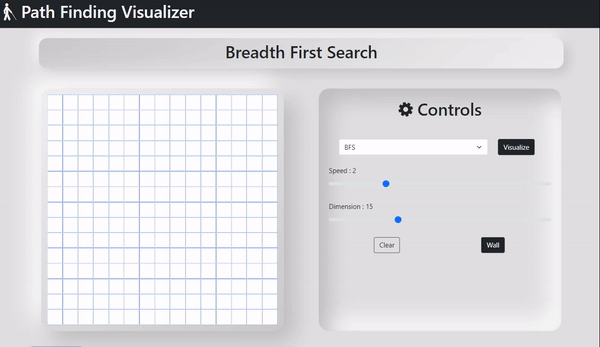

# PATH FINDING VISUALIZER

## WEBSITE PREVIEW

### SEARCHING VISUALIZER

- Depth First Search
- Breadth First Search

### PATH FINDING VISUALIZER

- Dijikstra Algorithm
- A* Algorithm

#### LANGUAGE AND DEPLOYMENT

 
 

  

 
 
 

### Depth First Search and Breadth First Search

### Dijikstra Algorithm and A\* Algorithm

